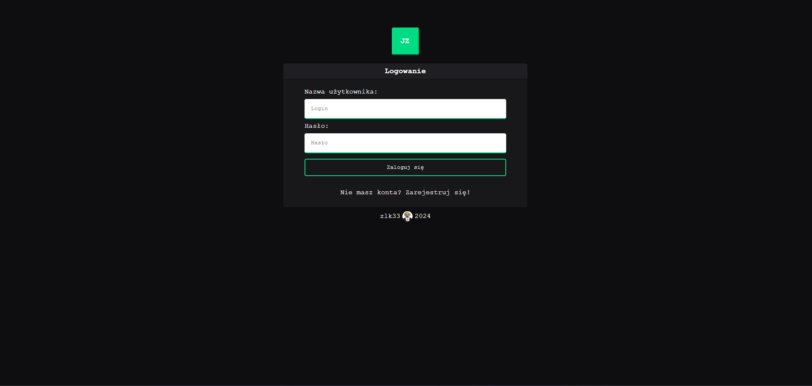
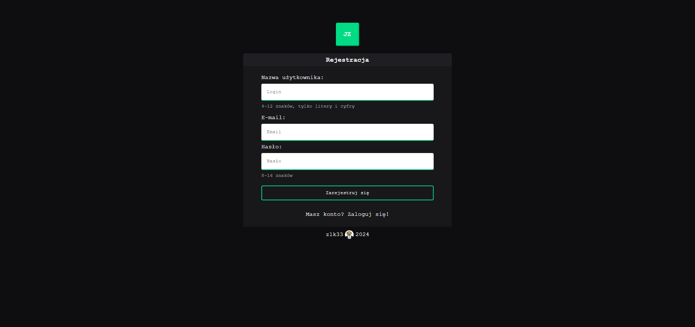
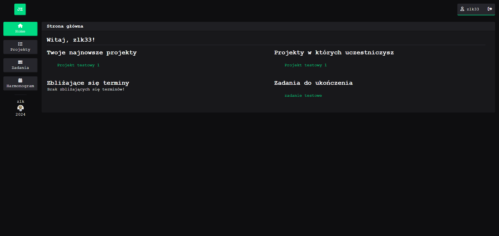
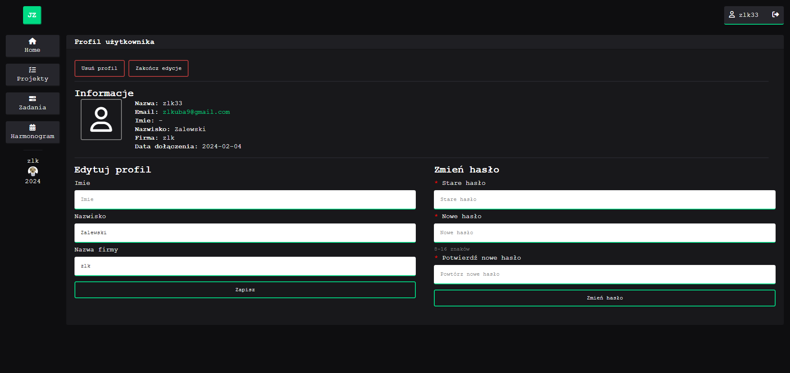
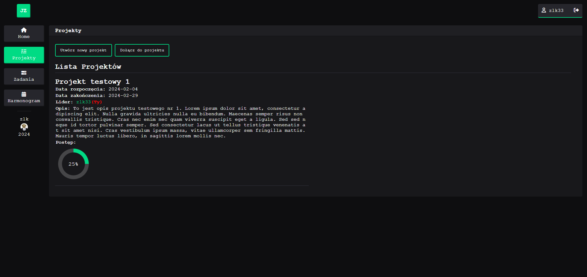
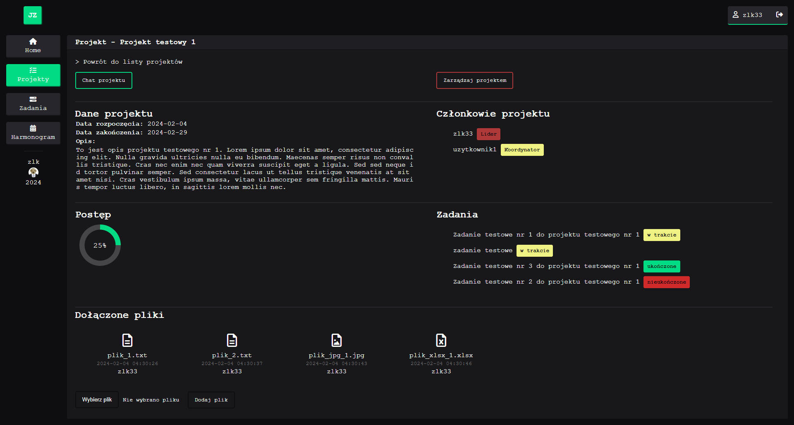
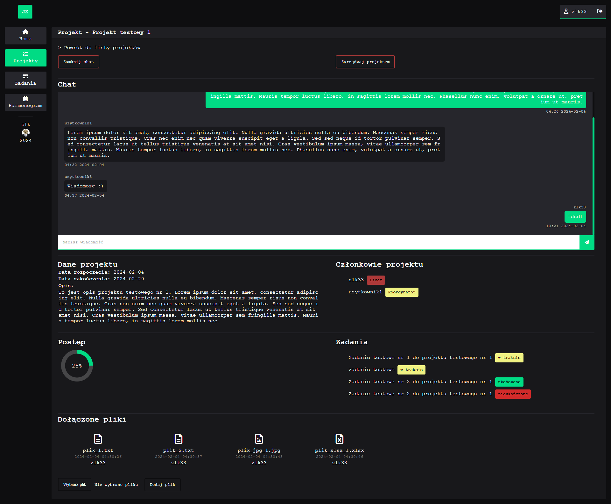
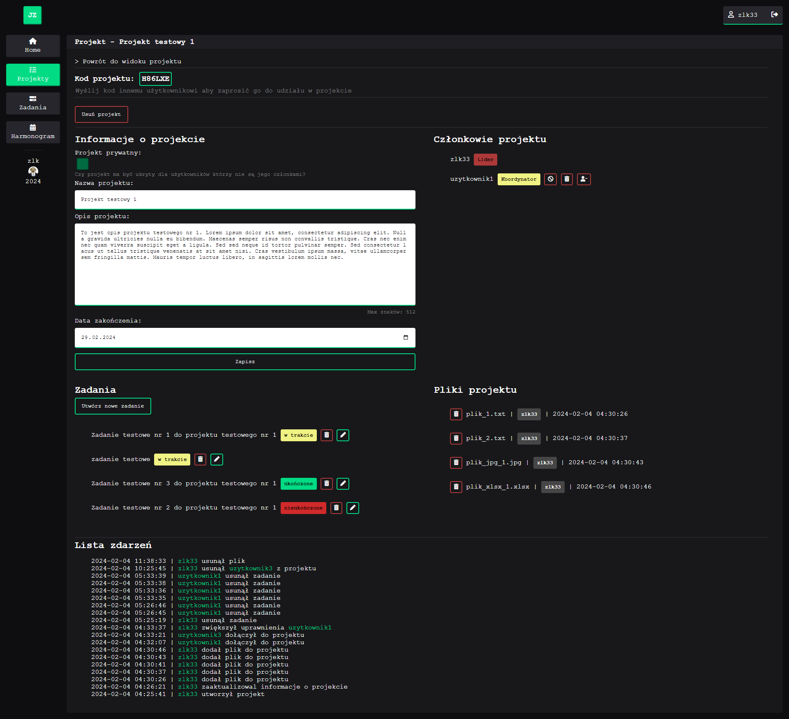

# Panel do zarządzania projektami i zadaniami

Projekt przygotowany na zaliczenie przedmiotu na studiach. Aplikacja pozwala na rejestracje/logowanie użytkowników, tworzenie projektów i zadań.

# Wykorzystane technologie


# Możliwości
+ Rejestracja/logowanie
+ Edycja profilu
+ Tworzenie projektów
    * Zarządzanie projektem
        * Dodawanie zadań
            * Przypisywanie zadań członkom projektu
        * Zarządzanie uczestnikami
        * Monitorowanie zdarzeń
        * Dodawanie plików
    * Chat projektu

# Wygląd








# Uruchamianie

W plikach projektu znajduje się plik **management_panel.sql** który należy zaimportować do bazy MYSQL. Następnie w pliku konfiguracyjnym **db_config.php** ustawiamy połączenie z bazą danych.
```
<?php
    $db_ip = "localhost"; //Adres serwera
    $db_login = "root"; //Login do bazy danych
    $db_pass = ""; //Hasło 
    $db_name = "management_panel"; //Nazwa bazy danych
?>
```